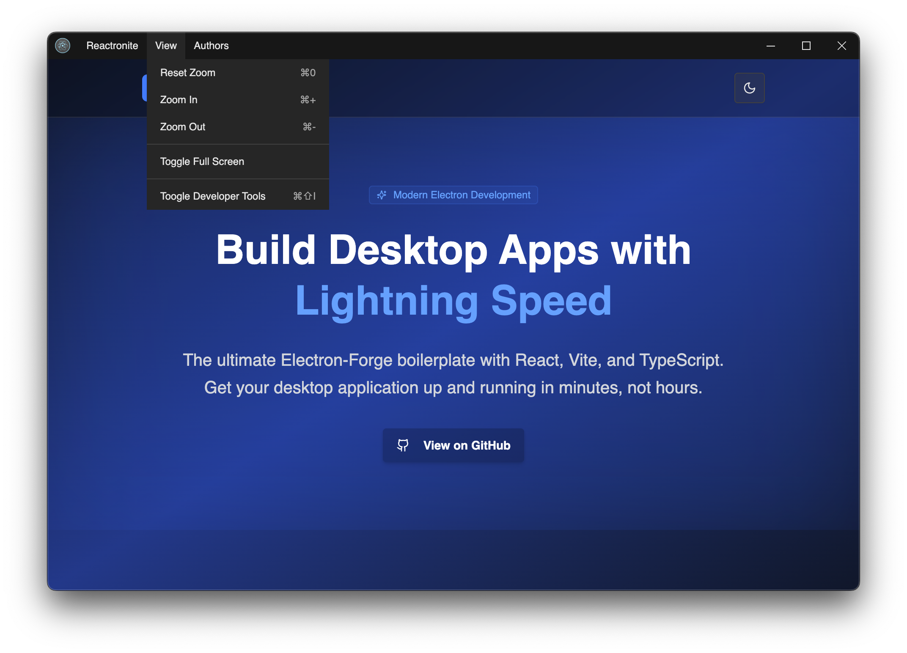

# EFRV Boilerplate

## Introduction

This is a boilerplate project for Electron-Forge with React, Typescript, and Vite.

## Features

- Custom titlebar with control buttons and menus.
- Preload script with a minimal set of methods exposed from Electron's `ipcRenderer` to support communication to main process.
- Window state manager.
- Simple React application using SASS stylings.
- ESLint and Prettier configuration
- Husky to handle git hooks

## Screenshots

## Getting Started

To get started with this project, follow these steps:

1. Clone this repository.
2. Install dependencies with `yarn install`.
3. Run the application with `yarn start`.

## Contributing

Contributions are welcome! Please see [CONTRIBUTING.md](./CONTRIBUTING.md) for more information.

## License

This project is licensed under the terms of the [MIT license](./LICENSE).
